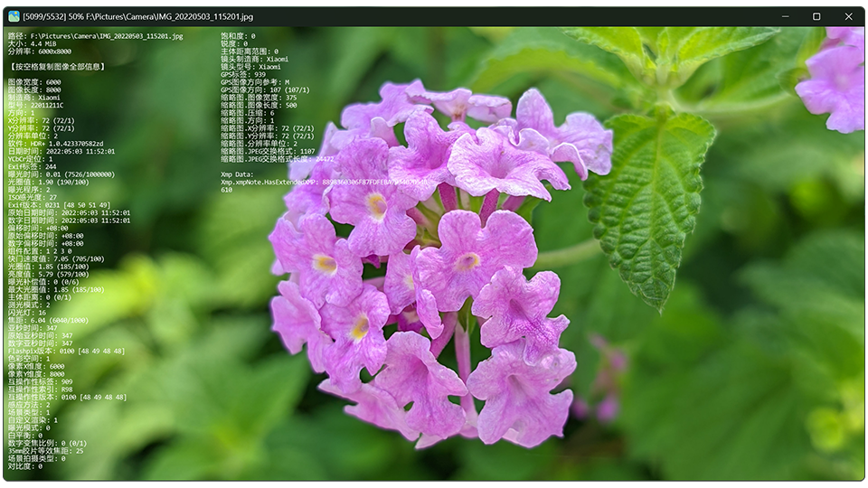

<p align="center">
  
</p>

<h1 align="center">YeImageViewer 看图</h1>

<p align="center">
  <a href="LICENSE"></a>
  
</p>

<p align="center">中文 | <a href="README_EN.md">English</a></p>

**YeImageViewer** 是一款简约、快速的原生 Windows 图片查看器，支持常见静态图、动图、RAW、iOS Live Photo 和 Android Motion Photo，并提供 EXIF 查看、打印、简单编辑和文件关联功能。

当前版本：**v1.36.5** · [修改记录](CHANGELOG.md)

本项目基于 [JarkViewer](https://github.com/jark006/JarkViewer) 开发，并遵循 GNU GPL v3 许可证。感谢上游作者 JARK006 与所有贡献者。



## 操作方式

1. 切换图片：窗口左右边缘单击或滚轮，或按 `←` / `→`
2. 放大缩小：窗口中间滚轮，或按 `↑` / `↓`
3. 旋转图片：右下角工具条，或按 `Q` / `E`
4. 平移图片：鼠标拖动，或按 `W` / `A` / `S` / `D`
5. 图像信息：点击滚轮，或按 `Tab` / `I`
6. 全屏：双击窗口，或按 `F` / `F11`
7. 复制图像：`Ctrl + C`
8. 打印图像：右键菜单，或按 `Ctrl + P`
9. 设置：右下角工具条，或按 `F1`
10. 逐帧浏览：顶部控制栏，或按 `J` / `K` / `L`
11. 分解动图：`Ctrl + S`

主窗口默认保持 4:3，高度为当前显示器工作区的 90%；宽度不足时以工作区宽度的 90% 为上限。小图保持 100%，大图仅在超出窗口时等比缩小，旋转方向会按图片路径自动保存。
设置中的“记住最后使用的显示器”默认开启；如果该显示器已断开，窗口会回到主显示器。

## 格式支持

- 静态：`apng avif avifs blp bmp dib exr gif hdr heic heif ico icon jfif jp2 jpe jpeg jpg jxl jxr livp pbm pfm pgm pic png pnm ppm psd pxm qoi ras sr svg tga tif tiff webp wp2`
- 动态：`gif webp png apng jxl avif`
- 实况：`livp`、`jpg/heic/heif` 中的 LivePhoto、MicroVideo 或 MotionPhoto（暂不播放声音）
- RAW：`3fr ari arw bay cap cr2 cr3 crw dcr dcs dng drf eip erf fff gpr iiq k25 kdc mdc mef mos mrw nef nrw orf pef ptx r3d raf raw rw2 rwl rwz sr2 srf srw x3f`

## 构建与本机安装

需要 Windows x64、Visual Studio 2026 Build Tools、MSVC v145 和项目所需静态库。

```powershell
.\buildRelease.ps1
.\installLocal.ps1
```

构建产物位于 `x64/Release`。安装脚本默认安装到 `%LOCALAPPDATA%\Programs\YeImageViewer`，注册当前用户的缩略图组件并创建开始菜单快捷方式；它不会自动改变图片文件的默认打开程序。

本仓库从 JarkViewer 浅克隆开始开发。若重新准备上游源码，建议保留 README 推荐的浅克隆方式：

```sh
git clone git@github.com:jark006/JarkViewer.git --depth=50
```

上游静态库可从 [JarkViewer static_lib](https://github.com/jark006/JarkViewer/releases/tag/static_lib) 获取。上游实现资料可参考 [DeepWiki](https://deepwiki.com/jark006/JarkViewer) 和 [Zread](https://zread.ai/jark006/JarkViewer)。

## 系统兼容

- 支持 64 位 Windows 10 和 Windows 11。
- 不支持 32 位 Windows 和 Windows 7 及更早版本。

## 许可证

本项目采用 GPL-3.0 许可证开放源代码，详见 [LICENSE](LICENSE)。
