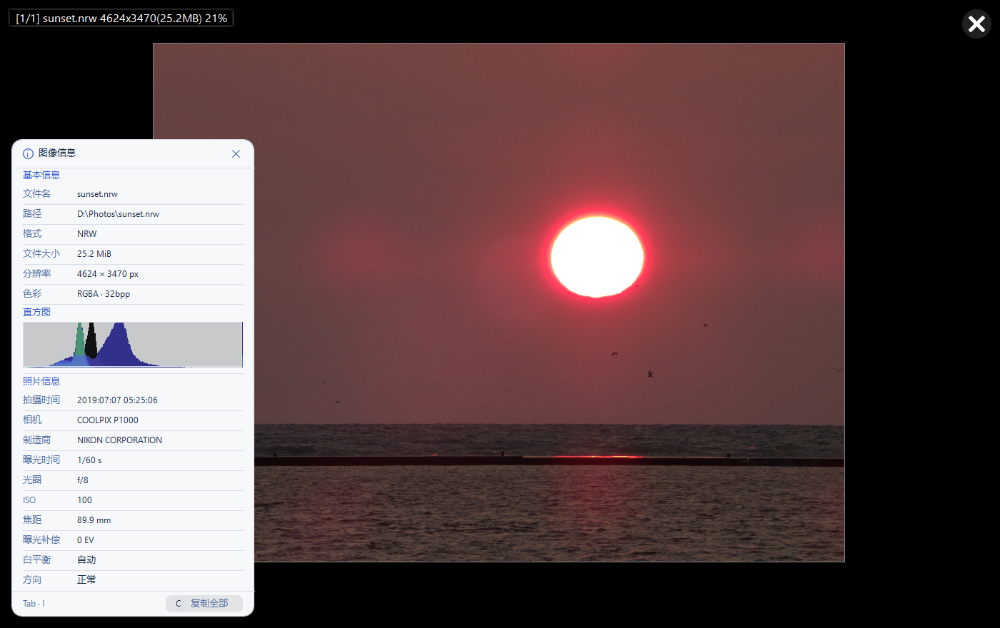

<p align="center">
  
</p>

<h1 align="center">YeImageViewer</h1>

<p align="center">
  <a href="LICENSE"></a>
  
</p>

<p align="center"><a href="README.md">中文</a> | English</p>

**YeImageViewer** is a minimal, fast native Windows image viewer. It supports common still images, animations, RAW files, iOS Live Photos, and Android Motion Photos, together with EXIF display, printing, simple editing, and file associations.

Current version: **v1.37.6** · [Changelog](CHANGELOG.md)

This project is based on [JarkViewer](https://github.com/jark006/JarkViewer) and is licensed under GNU GPL v3. Thanks to upstream author JARK006 and all contributors.



> Immersive view with the full information panel. The sample photo comes from [raw.pixls.us](https://raw.pixls.us/) (CC0 public domain), shot on a Nikon COOLPIX P1000.

## Controls

1. Switch images: use the bottom toolbar, or press `Left` / `Right`
2. Zoom: use `Ctrl + mouse wheel`, or press `Up` / `Down`
3. Rotate: use the bottom-right toolbar, or press `Q` / `E`
4. Pan: use the unmodified wheel vertically and `Shift + mouse wheel` horizontally, drag with the mouse, or press `W` / `A` / `S` / `D`
5. Image information: click the mouse wheel, or press `Tab` / `I`
6. Fullscreen: double-click, or press `F` / `F11`
7. Copy image: `Ctrl + C`
8. Print image: use the context menu, or press `Ctrl + P`
9. Settings: use the bottom-right toolbar, or press `F1`
10. Browse frames: use the top controls, or press `J` / `K` / `L`
11. Split an animation into frames: `Ctrl + S`

Every keyboard shortcut and all three wheel actions can be reassigned on the Settings “Shortcuts” tab. Changes are stored in the existing 4096-byte settings file and survive restarts.

Opening an image now starts in a borderless immersive preview covering the current monitor work area. A per-pixel-alpha black layer at roughly 60% opacity keeps the desktop visible while the image itself stays opaque; Windows frosted glass is not used. After returning to the framed window, the area outside the image switches to opaque `#7F7F7F` middle gray and remains stable when resized. Small images use logical 100% at the current DPI. Landscape images are capped at 90% of the work-area width and 82.5% of its height; portrait images shrink only when their width exceeds 90%, and may be panned vertically when taller than the viewport.
Clicking the background outside the image or pressing `Esc` returns to a framed window sized for the image currently visible at the moment presentation ends, capped at 90% of the monitor work area. If another image is selected while immersive, that image determines the restored frame. Once framed, browsing previous or next images keeps the frame fixed while each image retains its own preview zoom. Rotation is remembered per image path.
“Remember Last Monitor” is enabled by default; if that monitor is disconnected, the window falls back to the primary display.

## Format support

- Still: `apng avif avifs blp bmp dds dib exr gif hdr heic heif ico icon jfif jp2 jpe jpeg jpg jxl jxr lep livp pbm pcx pfm pgm pic png pnm ppm psd psdt pxm qoi ras sr svg tga tif tiff webm webp wp2`
- Animated: `gif webp png apng jxl avif`
- Video (decoded only when opened directly, as an animation of the first frames; never listed while paging through a folder): `3gp avi evo flv m2ts m4v mkv mov mp4 mts mxf ts vob wmv`
- Live: LivePhoto, MicroVideo, and MotionPhoto in `livp`, `jpg`, `heic`, or `heif` files, including the audio recorded with the clip (autoplay is muted by default; hover the LIVE badge to replay with sound)
- RAW: `3fr ari arw bay cap cr2 cr3 crw dcr dcs dng drf eip erf fff gpr iiq k25 kdc mdc mef mos mrw nef nrw orf pef ptx r3d raf raw rw2 rwl rwz sr2 srf srw x3f`

## Build and local install

The build requires Windows x64, Visual Studio 2026 Build Tools, MSVC v145, and the project's static libraries.

```powershell
.\buildRelease.ps1
.\installLocal.ps1
.\packageRelease.ps1 -SkipBuild
```

Build outputs are written to `x64/Release`.

**This is a portable application — there is nothing to install.** Copy `YeImageViewer.exe` anywhere and double-click it. It writes no registry keys and leaves no background service. Settings live in `YeImageViewer.db` (about 4 KB) next to the executable: **created when missing, reused when present**; delete it to return to defaults and the viewer still runs. To hand the viewer to someone else or move it to another machine, the single executable is enough; copy `YeImageViewer.db` alongside it to carry your settings (language, theme, shortcuts, registered formats, per-image rotation) across. Deleting the folder removes it completely — nothing is left in the registry. `YeThumbnailProvider.dll` is optional: it only matters if you want Explorer to show thumbnails for RAW/HEIC/AVIF/PSD and the other formats Windows cannot read itself.

`installLocal.ps1` is an optional convenience script: it copies the runtime to `%LOCALAPPDATA%\Programs\YeImageViewer`, registers the per-user thumbnail provider, and creates Start-menu and desktop shortcuts. It does not change default image-file applications. Skipping it changes nothing about how the viewer works.

`packageRelease.ps1` produces three artifacts, each held under the 25 MiB download budget:

| Artifact | Size | Use |
| --- | --- | --- |
| `YeImageViewer.exe` | ~27 MiB | Just want to view images — download this alone |
| `...-portable.zip` | ~15 MiB | Opens in Explorer without extra software; includes the thumbnail DLL |
| `...-portable.7z` | ~8 MiB | Smallest; needs 7-Zip |

There is no longer a one-click installer. It was built from a 7-Zip SFX module whose version info reads `7z Setup SFX small`, so the Windows Program Compatibility Assistant classified it as an installer; because it never wrote an uninstall entry, **every run ended with a "This program might not have installed correctly" dialog**. The viewer is a portable single file to begin with, so the installer bought nothing worth that dialog.

This repository started as a shallow clone of JarkViewer. To prepare the upstream source again, keep the shallow-clone recommendation:

```sh
git clone git@github.com:jark006/JarkViewer.git --depth=50
```

Upstream static libraries are available from [JarkViewer static_lib](https://github.com/jark006/JarkViewer/releases/tag/static_lib), but its `avif.lib` and `heif.lib` cannot be used as-is:
a viewer only decodes, so this repository drops the AV1 (aom) and HEVC (x265) encoders and no longer links `x265-static.lib`.
Rebuild those two libraries once before building (this is where the 4.9 MiB size difference comes from):

```powershell
.\scripts\build-thirdparty-slim.ps1 -Install   # libavif / libheif, encoders dropped
.\scripts\build-opencv-slim.ps1 -Install       # opencv_world, IPP and unused modules dropped
```

Additional upstream implementation notes are available on [DeepWiki](https://deepwiki.com/jark006/JarkViewer) and [Zread](https://zread.ai/jark006/JarkViewer).

## Compatibility

- Supports 64-bit Windows 10 and Windows 11.
- Does not support 32-bit Windows or Windows 7 and earlier.

## License

This project is open source under GPL-3.0. See [LICENSE](LICENSE).
